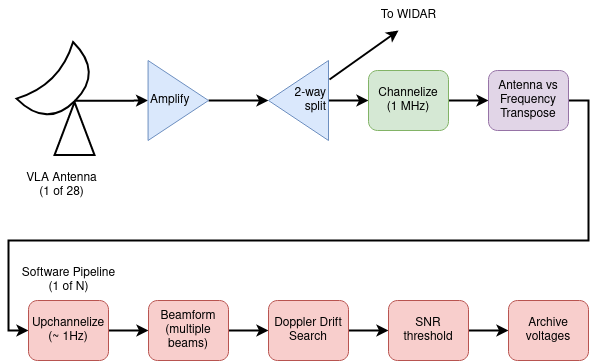

# COSMIC Top-Level System Description

## Introduction

COSMIC (The _Commensal, Open-Source, Multi-mode Interferometer Cluster_) is a real-time digital signal processing system, implemented on a cluster of Field Programmable Gate Arrays (FPGAs) and off-the-shelf GNU/Linux servers accelerated by GPU cards.
COSMIC is fed by a copy of the digitized data streams transmitted from each VLA antenna, such that the system can operate concurrantly with the VLA facility correlator, WIDAR.
The COSMIC DSP pipeline searches VLA data for narrowband (~1 Hz) signals which may be drifting in frequency over time.
A high-level depiction of COSMIC processing steps is shown below.

||
|:--:|
|*A high-level representation of data flow in the COSMIC system.
Digitized data streams from each VLA antenna are amplified and split, with one copy feeding the COSMIC DSP pipeline and the other feeding WIDAR.
The COSMIC frontend DSP pipeline channelizes (using FPGAs) data streams to 1 MHz resolution, and then distributes channels over multiple backend DSP pipelines (implemented on CPU/GPUs).
Backend pipelines further channelize to ~1 Hz resolution, and search for narrowband drifting signals.
When signals are detected, the per-antenna, 1 Hz voltages are archived around the time-frequency extent of the detected signal.*|
