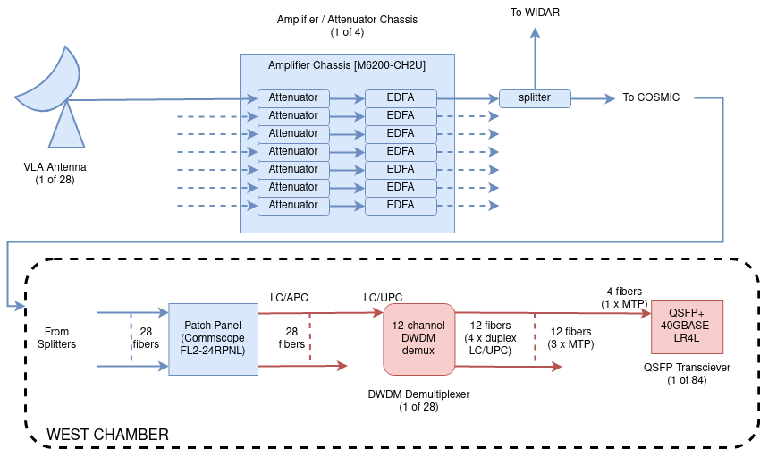

# COSMIC Top-Level System Description

## Introduction

COSMIC (The _Commensal, Open-Source, Multi-mode Interferometer Cluster_) is a real-time digital signal processing system at the VLA, implemented on a cluster of Field Programmable Gate Arrays (FPGAs) and off-the-shelf GNU/Linux servers accelerated by GPU cards.
COSMIC is fed by a copy of the digitized data streams transmitted from each of the 28 VLA antennas, such that the system can operate concurrantly with the VLA facility correlator, WIDAR.
The COSMIC DSP pipeline searches VLA data for narrowband (~1 Hz) signals which may be drifting in frequency over time.
A high-level depiction of COSMIC processing steps is shown below.

||
|:--:|
| *A high-level representation of data flow in the COSMIC system. Digitized data streams from each VLA antenna are amplified and split, with one copy feeding the COSMIC DSP pipeline and the other feeding WIDAR. The COSMIC frontend DSP pipeline channelizes (using FPGAs) data streams to 1 MHz resolution, and then distributes channels over multiple backend DSP pipelines (implemented on CPU/GPUs). Backend pipelines further channelize to ~1 Hz resolution, and search for narrowband drifting signals. When signals are detected, the per-antenna, 1 Hz voltages are archived around the time-frequency extent of the detected signal.* |

While this pipeline is conceptually simple, the practical implementation is complicated.
In addition to the signal processing tasks (i.e., upchannelizing, doppler searching, etc.) the system must also:

 - Monitor what the VLA antennas are doing -- where they are pointed, how receivers are tuned.
 - Calculate (using appropriate commensal observations) calibration gains for each antenna.
 - Choose, and track, a fixed phase-center over the coarse of a search pipeline execution.
 - Generate appropriate beam co-ordinates, and use these to derive beamforming coefficients
 - Archive results in a searchable fashion, with tracable records of system performance.

These tasks are in addition to the more mundane monitoring and control of a multi-node FPGA/CPU/GPU processing cluster.
This document attempts to provide a high-level overview of how COSMIC accomplishes these tasks, and how the many software processes in the COSMIC system interact with one another.
It also serves as a reference for hardware models, and locations of code repositories.

## Hardware

To the greatest extent possible, all hardware used in COSMIC is off-the-shelf.

### Optical Hardware

The optical frontend of COSMIC comprises optical Erbium-Doped Fiber Amplifliers (EDFAs), optical splitters, patch panels, and Dense Wavelength-Division Multiplexing (DWDM) demultiplexers.
All but the latter are formally owned by the National Radio Astronomy Observatory (NRAO).

NRAO hardware accomodates 35 antennas (i.e. 28 antennas + 7 spares). SETI Institute hardware accomodates 30 antennas (i.e. 28 antennas + 2 spares)

All optical hardware was sourced from [Fiberstore](http://www.fs.com).

||
|:--:|
| *The COSMIC optical frontend. NRAO-owned equipment is shown in blue. SETI-Institute-owned equipent is shown in red.* |

NRAO-owned components are:

| Manufacturer | Description | Model | Required | Spares |
| -- | -- | -- | -- | -- |
| Fiberstore | 2U Amplifier Chassis | [M6200-CH2U](https://www.fs.com/products/107371.html) | 4 | 1 |
| Fiberstore | Variable Optical Attenuator | [M6200-SFPVOA](https://www.fs.com/products/107373.html) | 28 | 7 |
| Fiberstore | Amplifier | [M6200-25PA](https://www.fs.com/products/107367.html) | 28 | 7 |

SETI Institute owned components:

| Manufacturer | Description | Model | Required | Spares |
| -- | -- | -- | -- | -- |
| Fiberstore | 1U FMU Chassis | [FMU-1UFMX-N](https://www.fs.com/products/30408.html) | 15 | 1 |
| Fiberstore | DWDM Demux | 12DWDM-SF | 28 | 2 |
| Fiberstore | LC-MTP cables | 146834 | 84 | 6 |
| Fiberstore | 40GBASE-PLR4 QSFP+ | [QSFP-PIR4-40G](https://www.fs.com/products/48276.html) | 84 | 21 |

#### DWDM Dumux

COSMIC Demuxes are built to order to support ITU DWDM channels C21, C23, C25, C27, C29, C31, C33, C35, C37, C39, C41, C43.
They are packaged in FMU modules, and provide only demultiplex (no multiplex) capability.
Two DWDM demultiplexers are hosted in a 1U dual-FMU chassis.
Originally, the project procured 30 demux units configured for standard 100GHz-separated DWDM channels.
These have a specified passband of +/- 0.11 nm.
During commissioning, it was observer that some antennas were transmitting at wavelengths which had significantly drifted from their expected centers, and these were emerging from the demux units with very low power. More recently (March 2023) 4 units were obtained with 200 GHz channel separation, and +/-25nm passbands.
These "wideband" demux units have been shown to work successfully with the previously problematic antenna transmitters.

#### LC / MTP cables

The COSMIC demux units output data over 12 fibers, configured as 6 duplex LC/UPC connectors.
For each antenna connection, these 12 fibers are interfaced with 3 QSFP+ transceivers via MTP connectors.
While off-the-shelf duplex LC - MTP fiber cables are available, the COSMIC system is unusual in that it only utilizes the receive-side of the QSFP+ transceivers, and customized cables which connect only the relevant MTP fibers have been procured for COSMIC.
These have the following specification:

 - Connector A: MTP Female APC 0.35dB
 - Connector B: 2 x LC/UPC Duplex
 - Breakout Length: 0.3 m equal breakout
 - Breakout Leg: 2.0 mm
 - Polarity: MTP Type A
 - Length: 4m
 - Cable Jacket: LSZH
 - Fiber Count: 4 Fibers (MTP fibers 1,2,3,4 only)
 - Fiber type: OS2

#### QSFP+ transceivers

COSMIC uses 40GBASE-PLR4 transceivers to interface VLA fibers with FPGAs.
These transceivers are designed to service 40Gb/s Ethernet links up to 10km in reach.
While the transceivers are designed to operate with 1310 nm lasers, practical experience has shown that they will also operate effectively with 1550 nm carriers.
The parts used by COSMIC have a stated receiver sensitivity (at 1310 nm) of -14.4 dBm, and lab tests have shown bit error rates better than 1 in 10^13 with -19dBm 1550 nm inputs.

### FPGAs

COSMIC uses [Xilinx Virtex UltraScale+ VU37P FPGAs](https://www.xilinx.com/products/silicon-devices/fpga/virtex-ultrascale-plus.html) to perform signal processing, integrated into AlphaData's [ADM-PCIE-9H7](https://www.alpha-data.com/dcp/products.php?product=adm-pcie-9h7) PCIe cards.

Each ADM-PCIE-9H7 processes signals from 2 antennas, and the COSMIC system contains 14 ADM-PCIE-9H7 cards plus one spare.

The installation and configuration of these cards in 4U servers is described in [fpga_installation](./fpga\_server\_bringup.md).

### CPU/GPU servers

COSMIC uses [Supermicro 4124GS-TNR](https://www.supermicro.com/en/Aplus/system/4U/4124/AS-4124GS-TNR.cfm) servers, hosting GPUs, 100GbE NICs, and deep, fast, NVMe storage buffers.
These specs of these servers are described in [Hardware](../Infrastructure/Hardware.md).

Server MAC addresses can be found in the [COSMIC netboot configuration files](https://github.com/COSMIC-SETI/cosmic-netboot/blob/main/group_vars/all/canonical_names.yml)

The configuration of these servers is described in [netboot_server_bringup](./netboot_server_bringup.md).

### Storage Servers

### Head node

### Networking

### System Layout

## System Behaviour

 1. Observations are specified in `YAML` files, which define system behaviour associated with a particular VLA telescope state.

## Software

### COSMIC Services

See [this list](../SoftwareSystem/index_systemd.md)

