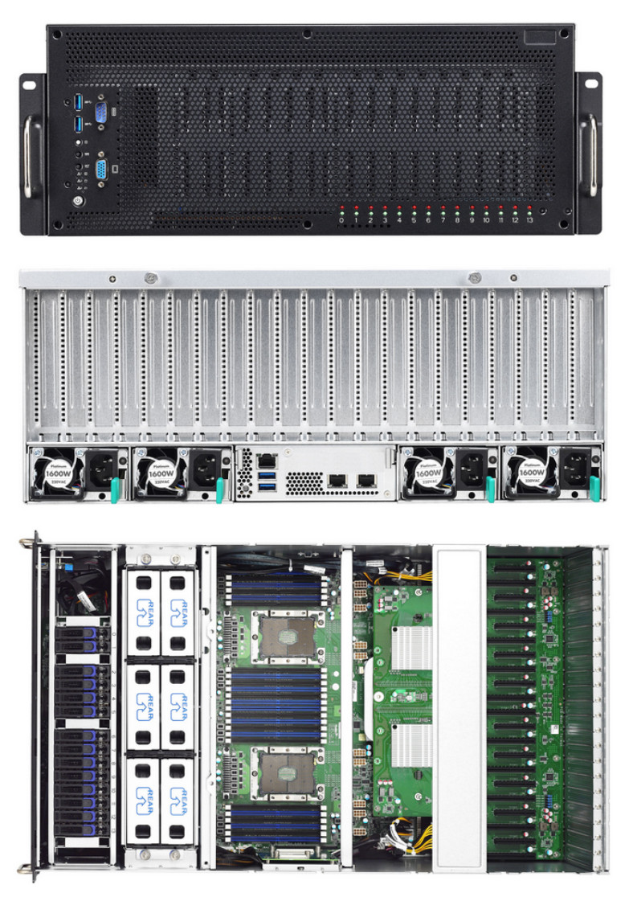
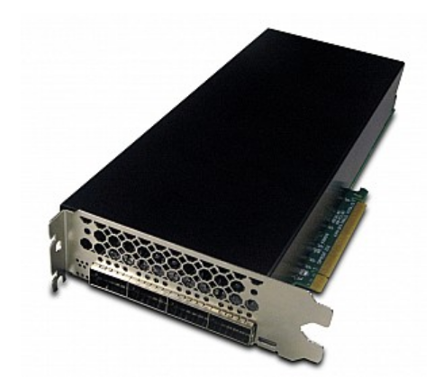
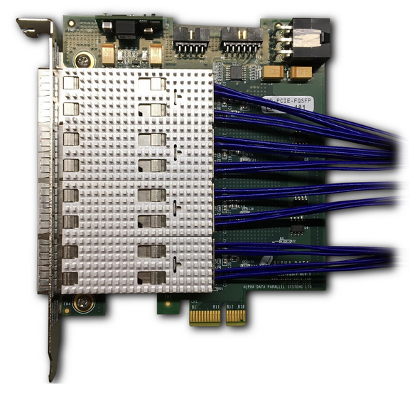
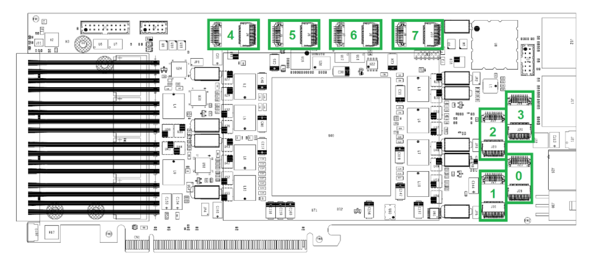
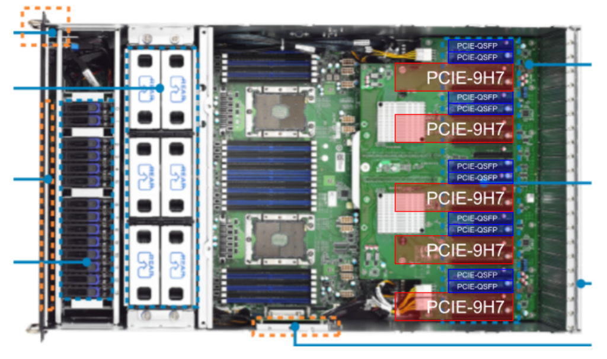

# COSMIC FPGA Server Configuration
Author: Jack Hickish
Date: 25th May 2023

## Introduction

The COSMIC FPGA subsystem comprises 15 Alpha Data ADM-PCIE-9H7 PCIe FPGA cards,
hosted in 3 Tyan B7119F77V10E4HR-2T55-N servers.
These FPGA cards are controlled via PCIe, which requires appropriate configuration
of supporting software. The configuration of this software, and details of the FPGA
hardware configuration are describer here.

## Hardware

The COSMIC FPGA subsystem is made up of:

 - 3 x Tyan [B7119F77V10E4HR-2T55-N](https://www.tyan.com/Barebones_FA77B7119_B7119F77V10E4HR-2T55-N) 4U server (Sourced from [Acme Micro](acmemicro.com); quote SH54735)

Each server comprises:

 - 1 x Samsung MZ-76P512E 512GB SATA SSD
 - 2 x Intel Xeon Silver 4208 CPU
 - 6 x 16GB PC4-25600 DDR4-3200MHz Memory
 - 5 x Alpha Data [ADM-PCIE-9H7](https://www.alpha-data.com/product/adm-pcie-9h7/) FPGA card
 - 10 x Alpha Data [AD-PCIE-FQSFP](https://www.alpha-data.com/product/ad-pcie-fqsfp/) quad-port QSFP28 adapter

||
|:--:|
| *The B7119F77V10E4HR-2T55-N 4U server* |

||
|:--:|
| *The ADM-PCIE-9H7 FPGA card* |

||
|:--:|
| *The AD-PCIE-FQSFP quad QSFP28 add-on card* |

### Connecting FPGA cards to QSFP28 add ons

**NB: The [ADM-PCIE-9H7 User Manual](https://www.alpha-data.com/xml/user_manuals/adm-pcie-9h7%20user%20manual_v1_4.pdf) is available online and should be consulted for further information.**

The COSMIC system requires that each ADM-PCIE-9H7 FPGA card be connected to two AD-PCIE-FQSFP quad-QSFP add on cards.
The connections between these cards are via _Firefly_ connectors, of which there are 8 on each FPGA board, shown below.

||
|:--:|
| *The ADM-PCIE-9H7 firefly ports, from the [User Manual](https://www.alpha-data.com/xml/user_manuals/adm-pcie-9h7%20user%20manual_v1_4.pdf)* |

The procedure for connecting QSFP and FPGA cards is as follows:

1. Remove the cover from the ADM-PCIE-9H7. Section 3.12.1 of the [User Manual](https://www.alpha-data.com/xml/user_manuals/adm-pcie-9h7%20user%20manual_v1_3.pdf) describes how to do this. Pay particular attention to the board's fan cables, which need to be disconnected before completely removing the board cover, and should be reconnected prior to cover reinstallation.

2. Install two AD-PCIE-FQSFP boards, as described in section 3.5 of the [User Manual](>https://www.alpha-data.com/xml/user_manuals/adm-pcie-9h7%20user%20manual_v1_3.pdf).
One QSFP add on card should be connected to Firefly ports 0-3 (see image above) and the other to ports 4-7. **Cable should be connected such that the "bottom" QSFP port (when installed in a PCIe slot) is connected to the lowest-numbered Firefly port in a set of 4, and from bottom to top, QSFPs are connected to Firefly ports `n`, `n+1`, `n+2`, `n+3`.**

3. Reinstall the ADM-PCIE-9H7 cover. Again, see section 3.12.1 of the [User Manual](https://www.alpha-data.com/xml/user_manuals/adm-pcie-9h7%20user%20manual_v1_3.pdf) and be sure to connect fan cables before screwing the cover back in place.


### FPGA Card Install

5 FPGA cards, each hosting two quad-QSFP28 add-on cards, are installed in each server.

They are installed in the bellow configuration, such that each FPGA card occupies an x16 PCIe slot, and two QSFP28 cards are next to each FPGA.

||
|:--:|
| *The server PCIe slots allocated to FPGA and QSFP cards*|

QSFP cards are installed such that the board connected to Firefly ports 0-3 is positioned next to the FPGA card.

#### Power Cable Installation

Every ADM-PCIE-9H7 board has an 8-pin standard GPU power connector.
This should be connected to the power headers on the server motherboard.
AD-PCIE-QSFP cards *do not* require power connections.

## Software

### Operating System

Each FPGA server has a local Operating System -- Ubuntu 20.04.2, 64-bit, server edition -- installed to its 512GB NVMe drive.

At install, the primary user `cosmic` was configured.

To complete the below, you will probably need to install `build-essentials`, linux header files, `python3-venv` and other basic packages using `apt`.

### Control Software

1. Clone the main COSMIC FPGA repository and its git submodules

```
git clone https://github.com/realtimeradio/vla-dev # hash db93ff4da7a at time of writing
cd vla-dev
VLA_DEV_ROOT_DIR=`pwd`
git submodule init
git submodule update
```

2. Make a python3 virtual environment for software 

```
python3 -m venv ~/py3-venv # In production the COSMIC servers use Python 3.8.10
echo "source ~/py3-venv/bin/activate" >> ~/.bashrc
source ~/.bashrc
```

3. Install `casperfpga`

```
cd $VLA_DEV_ROOT_DIR/software/casperfpga
pip install -r requirements.txt
pip install .
```

4. Install `xdma` driver

```
cd $VLA_DEV_ROOT_DIR/software/dma_ip_drivers/XDMA/linux-kernel/xdma
make
sudo make install
```

5. Make the driver load with user permissions

```
echo 'KERNEL=="xdma*", OWNER="root", GROUP="plugdev", MODE="0660", SYMLINK+="$name"' >  /etc/udev/rules.d/50-xdma.rules
```

6. Make the driver load at boot

```
sudo depmod
sudo modprobe xdma
```

7. Also use DKMS to auto-update the module whenever the linux kernel upgrades. The `VERSION` below can be found in the `RELEASE` file if it has changed.

```
sudo apt install dkms
cd /usr/src
cp -R $VLA_DEV_ROOT_DIR/software/dma_ip_drivers/XDMA/linux-kernel/xdma xdma-2020.1.8
cp -R $VLA_DEV_ROOT_DIR/software/dma_ip_drivers/XDMA/linux-kernel/include/* xdma-2020.1.8

cat > xdma-2020.1.8/dkms.conf << EOF
PACKAGE_NAME="xdma"
PACKAGE_VERSION="2020.1.8"
#CLEAN="make -C ./ clean"
#MAKE="make -C ./ BUILD_KERNEL=${kernelver}"
BUILT_MODULE_NAME[0]="xdma"
BUILT_MODULE_LOCATION="."
DEST_MODULE_LOCATION[0]="/updates"
DEST_MODULE_NAME[0]="xdma"
AUTOINSTALL="yes"
EOF

sudo dkms add xdma/2020.1.8
sudo dkms build xdma/2020.1.8
sudo dkms install xdma/2020.1.8
```

If installation of the driver is successful _and_ an FPGA running suitable firmware is connected on the PCIe bus, `xdma*` devices should be visible in `/dev/`.

### Configure NTP

1. Install NTP client

```
sudo apt install systemd-timesyncd
```

2. Point client to local VLA NTP servers. These are `ntp2-a.evla.nrao.edu`, `ntp2-b.evla.nrao.edu`, and `ntp2-c.evla.nrao.edu`. The NTP client configuration file `/etc/systemd/timesyncd.conf` should include:

```
[Time]
NTP=ntp2-a.evla.nrao.edu
FallbackNTP=ntp2-b.evla.nrao.edu
```

3. Restart NTP client

```
systemctl restart systemd-timesyncd.service
```

### Configure FPGA board clocks

1. Compile ADM-PCIE-9H7 control software

```
cd $VLA_DEV_ROOT_DIR/software/alpha-data
tar -xf avr2util-s-linux-4.12.0.tar.gz
cd avr2util-s-4.12.0
make
```

2. Connect an FPGA board via USB. It should show up as device `/dev/ttyACM0`

3. Set reference clocks to 156.25 MHz

```
sudo ./avr2util-s -usbcom /dev/ttyACM0 setclk 0 156250000
sudo ./avr2util-s -usbcom /dev/ttyACM0 setclk 1 156250000
sudo ./avr2util-s -usbcom /dev/ttyACM0 setclknv 0 156250000
sudo ./avr2util-s -usbcom /dev/ttyACM0 setclknv 1 156250000
```

### Install FPGA boot image

In order to program CASPER-generated `.fpg` firmware images over PCIe, the target FPGA must already be running compatible skeleton firmware.
This is because programming the FPGA with an `.fpg` file utilises the "Partial Reprogrammability" of the FPGA, which programs only a subsection of the FPGA fabric, keeping important interfaces like PCIe alive.

The process of programming the FPGA boot image will likely cause the server in which the FPGA card is installed to lock up, so it is **strongly recommended** that the boot image update process is conducted from a machine other than the one hosting the FPGA board.

Boot images are installed to persistent flash memory, so can be installed prior to installation of the FPGA card in a server, if necessary.

1. Install Xilinx [Vivado Lab Tools](https://www.xilinx.com/support/download.html)

2. Obtain a copy of an appropriate boot image. This should match the "template" file of the production COSMIC firmware.
At present, the correct template files are available at `$VLA_DEV_ROOT_DIR/firmware/pr_templates/adm_pcie_9h7_dts_dual_4x100g_pr_template.*.mcs`

3. Open Vivado, connect to the hardware manager, and locate the VU37P FPGA. Add a configuration memory part (Micron part `MT25QU01GBBB8E12-0SIT`) as an x8 SPI device.

4. Write this flash with the `primary.mcs` and `secondary.mcs` flash files.

5. Reboot the FPGA host server (you may wish to program multiple boards before doing this)

### Install `remoteobjects` remote FPGA control interface

**NB: Do not install (or rather, do not run) the `remoteobjects` server until an FPGA boot image has been installed, and a compatible `INITIAL_FPGA_FILEPATH` (see below) has been defined.**

1. Clone `remoteobjects-py` repository

```
git clone https://github.com/MydonSolutions/remoteobjects-py.git # hash db93ff4da7ab at time of writing
cd remoteobjects-py.git
REMOTEOBJECTS_ROOT_DIR=`pwd`
```

2. Install library

```
pip install .
```

3. Start server service on boot:

    1. Create service environment file, which should point to the firmware image you wish the FPGAs to be programmed with at boot. **This _must_ be compatible with the boot image loaded to the FPGA's flash memory.**

    ```
    echo "INITIAL_FPGA_FILEPATH=/home/cosmic/src/vla-dev/firmware/adm_pcie_9h7_dts_dual_4x100g_dsp_8b/outputs/adm_pcie_9h7_dts_dual_4x100g_dsp_8b_2023-02-01_2054.fpg" > /home/cosmic/remoteobjects_server.conf
    ```

    2. Install service file, being sure to point to an appropriate python environment

    ```
    cat > /etc/systemd/system/remoteobjects_server.service << EOF
    [Unit]
    Description=The CASPER-FPGA remoteobjects Server
    After=network.target
    Requires=network.target

    [Timer]
    OnBootSec=1min

    [Service]
    EnvironmentFile=/home/cosmic/remoteobjects_server.conf
    Restart=always
    Type=simple
    ExecStart=/home/cosmic/py3-venv/bin/rest_serve_remoteobjects.py --fpgfile $INITIAL_FPGA_FILEPATH --program
    StandardOutput=append:/home/cosmic/logs/remoteobjects_server.out
    StandardError=append:/home/cosmic/logs/remoteobjects_server.err

    [Install]
    WantedBy=multi-user.target
    ```

    3. Enable service

    ```
    sudo systemctl enable remoteobjects_server.service
    ```
