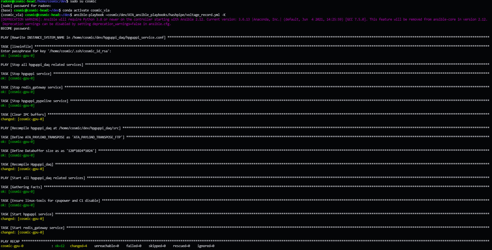

Also see:
- [Monitors](./Use-Monitors.md)
- [Services](./Use-Services.md)

# Context

All of these python scripts/commands are installed under the `cosmic` user, `cosmic_vla` conda environment. This environment is activated by default for the `cosmic` user.

<details><summary>Manual operation</summary>
<p>
```
...$ sudo su cosmic
(base) cosmic@cosmic-head:~/dev$ conda activate cosmic_vla
(cosmic_vla) cosmic@cosmic-head:~/dev$
```
</p>
</details>

# Starting up Hashpipe on the GPU Node(s)

Execute the provided scripts to restart/switch out the hashpipe instances on the GPU nodes:

Script | Recording Mode Description
-|-
`/home/cosmic/dev/cosmic-gpu-raw-mode.sh` | GUPPI RAW files, no processing.
`/home/cosmic/dev/cosmic-gpu-correlator-mode.sh` | XGPU correlated UVH5 files.

<details><summary>Manual operation</summary>
<p>

Under `cosmic` user, execute the ansible-playbook of choice:

Playbook | Recording Mode Description
-|-
voltage_record | GUPPI RAW files, no processing.
xgpu_record | XGPU correlated UVH5 files.
beamformer_record | BLADE Beamformed RAW files. *Not tested!!*

```
(cosmic_vla)$ ansible-playbook ~cosmic/dev/FrontPage/Nodes/Head/ansible_playbooks/hashpipe/voltage_record.yml -K
```



As is evident from the playbook printout, hashpipe is compiled and the systemd services `hpguppi` and `redis_gateway` are restarted on the GPU-compute nodes.

</p>
</details>

# Recording an observation with the array

Call the `observe.py` script with the filepath to an [observation-configuration yaml](https://github.com/COSMIC-SETI/COSMIC-VLA-PythonLibs/blob/main/docs/yaml_schema.md) file:
```
observe.py ~cosmic/dev/COSMIC-VLA-PythonLibs/scripts/config_yaml/obs_pulsar.yaml
```

<details><summary>Manual Operation</summary>
<p>

### Configuration of the array's FEngines

First configure the FEngines, specifying a configuration file):
```
configure_remotefpga.py ~cosmic/dev/COSMIC-VLA-PythonLibs/scripts/config_yaml/fen_dual_antenna_fullband.yaml
```

While the yaml file's contents are fairly static, one may wish to adjust the `antenna` and `chan_range` entries.
The `antenna` entry is an indented, bullet-point style list of the antenna names to configure.
The `chan_range` entry is a `[start, stop]` statement of the channel range to send to the encapsulating destination structure.

### Recording data with Hashpipe on the GPU Node(s)

Run `start_observation.py -i 5 -n 30`, where the former argument is the delay until observation start, and the latter is the observation duration, both in seconds.

Further options can be specified to achieve more. The full list is described under the help (`-h`) printout, but below are some common options:

Option | Description
-|-
-w baseband.0=.\*8BIT.\* | Wait for the META.baseband[0] value to contain "8BIT"
-w intents.ScanIntent=.\*CALIBRATE_BANDPASS.\* | Wait for the META.intents.ScanIntent value to contain "CALIBRATE_BANDPASS"
-k PROJID=dmpauto | Publish the key-value pair `PROJID=dmpauto` to the hashpipe instances (this detemines part of the path for the recorded file).
</p>
</details>

# Troubleshooting

If it appears that the hashpipe backends are non-operational (DAQPULSE is stale, or the IBVGBPS doesn't match the expected GB/s), [restart them](#Starting_up_Hashpipe_on_th_GPU_Node(s)).
