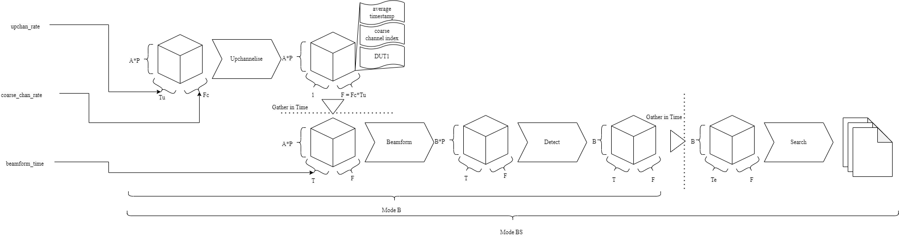

The below is a walkthrough of how the BLADE ATA mode BS process currently executes.

Symbol | Value
-|-
`Fc` | Number of Coarse Frequency Channels
`Tu` | Number of Timesamples per Fine-spectrum (upchannelisation rate)
`F` | Number of Fine Frequency Channels (`Fc*Tu`)
`T` | Number of Fine-spectra
`Te` | Number of Beamformed-Fine-spectra in dataset (exhaustive of time-range)
`Fs` | Number of Fine Frequency Channels to search
`A` | Number of Antenna
`B` | Number of Beams
`Bs` | Number of Beams to search
`P` | Number of Polarties
`S` | Number of bytes per complex sample

- A.1) Ingest `Fc` coarse-channels of enough timesamples (`Tu`) to produce 1 fine-spectrum.
  - Data is read from the disk into RAM
  - RAM usage: `A*Fc*Tu*P*S` bytes, VRAM usage: `0` Bytes
  - Dimensionality (Slowest->Fastest): A,F,T,P

- A.2) Channelize 1 fine-spectrum.
  - Data is transferred from RAM to VRAM
  - RAM usage: `0` bytes, VRAM usage: `A*F*1*P*S` Bytes
  - Dimensionality (Slowest->Fastest): A,F,T,P

- A.3) Collect `T` fine-spectra.
  - Data is collected in VRAM, being transferred within VRAM
  - RAM usage: `0` bytes, VRAM usage: `A*F*T*P*S` Bytes
  - Dimensionality (Slowest->Fastest): A,F,T,P

- A.4) Beamform `T` fine-spectra and detect producing {Beams=`B`, Freq=`Tu*Fc`, Time=`T`, Polarity=`1`}.
  - ***Use the average time-stamp of the fine-spectrum to calculate phasors with dimension of {Antenna=`A`, Freq=`Tu*Fc`, Time=1, Polarity=`P`}***
  - Data is transferred within VRAM
  - RAM usage: `0` bytes, VRAM usage: `B*F*T*P*S` Bytes
  - Dimensionality (Slowest->Fastest): B,T,P,F

- A.3) Collect `Te` beamformed-fine-spectra.
  - Data is transferred from VRAM to RAM
  - RAM usage: `A*F*Te*P*S` bytes, VRAM usage: `0` Bytes
  - Dimensionality (Slowest->Fastest): B,T,P,F

- A.5) Search 1 beam of `Te` beamformed-fine-spectra producing `.hits` and `.stamps` files, exhausting all beams.
  - Data is transferred from RAM to VRAM
  - RAM usage: `0` bytes, VRAM usage: `F*T*P*S` Bytes
